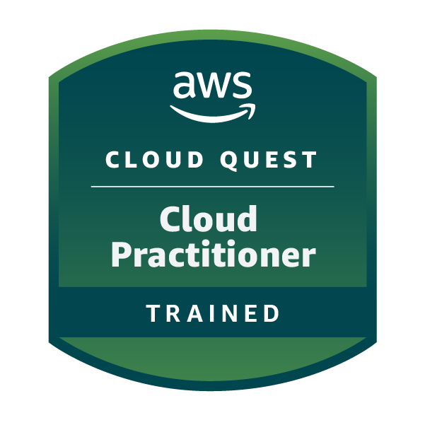

# Certificates and Badges earned in the re/Start program

## Certificates

### AWS SimuLearn - Core Security Concepts
This certificate tackles a simulated scenario where a stock exchange needs to seriously tighten up security. The goal is to restrict support engineers to only the system access needed for their specific jobs. I learned how to design and then actually build this essential, role-specific security solution using the AWS Management Console.

### AWS SimuLearn - Databases in Practicce
This one focuses on helping an insurance company's database administrators cut down on manual, tedious tasks like patching and managing infrastructure. The main focus is designing and building an AWS solution that improves database availability and makes the system run more efficiently. I got hands-on experience by constructing the proposed solution in a live AWS lab environment.

### AWS SimuLearn - File Systems in the Cloud
The challenge is helping a pet modeling agency share files across its various offices without the headache of managing physical storage. You are tasked with designing and implementing a cloud-based file-sharing solution on AWS. The process involves creating a design and then building it step-by-step to gain real-world, practical AWS experience.

### AWS SimuLearn - Networking Concepts
This certificate addresses a bank’s need to create a secure network setup that carefully manages communication between its internal resources and the public internet. You learn how to design the required architecture and then build it out in the AWS Management Console. This provides crucial hands-on experience with the networking tools and services that professionals use daily.

.png>)

### Introduction to AWS Identity and Access Management (IAM)
This course introduces you to AWS Identity and Access Management (IAM), showing you how to manage who can do what (authentication and authorization) within AWS services. It covers key components like IAM policies and roles, along with real-world use cases. I also got a demonstration on setting up IAM groups, users, and attaching necessary policies.

### Exploring Artificial Intelligence Use Cases and Applications
This certificate content dives into how Artificial Intelligence (AI), Machine Learning (ML), and Generative AI are used across tons of industries like finance and healthcare. The course helps you identify real-world AI applications, figure out when these solutions fit a business need (and when they don't), and understand concepts like model selection and business metrics. Essentially, it shows you the practical applications, limits, and capabilities of these technologies.

### Fundamentals of Machine Learning and Artificial Intelligence
This course lays the groundwork for understanding the connections between AI, ML, deep learning, and the newer field of Generative AI. It defines all the foundational terms, concepts, and different types of data/learning (like supervised or unsupervised learning). You'll also get a look at which AWS services use these capabilities to solve problems across various industries.

### Optimizing Foundation Models
The focus here is on two advanced techniques—Retrieval Augmented Generation (RAG) and fine-tuning—that are used to boost the performance of Foundation Models (FMs). You'll learn about AWS services for vector databases, the role of agents in complex tasks, and the methods for preparing data and executing the fine-tuning process. The core takeaway is knowing how to make an FM perform better and meet specific business goals.

### Responsible Artificial Intelligent Practices
This important course teaches you all about responsible AI, defining it and exploring its core dimensions. It covers how to address challenges like bias, manage the risks of Generative AI, and use the tools AWS provides for responsible development. A key part is understanding how to select models, prepare data responsibly, and ensure your AI systems are transparent and explainable.

### Developing Generative Artificial Intelligence Solutions

### Developing Machine Learning Solutions

## Badge(s)

### AWS Cloud Practitioner Training Badge

### AWS re/Start Graduate Badge